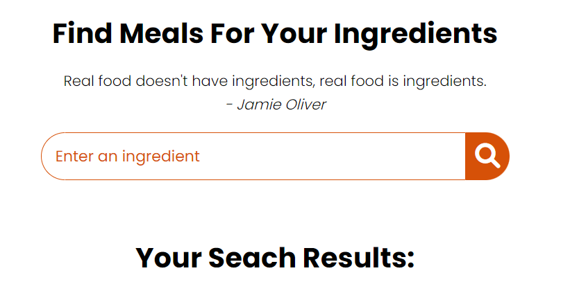

# Food Recipes

A simple web app that lets users find meal recipes based on the ingredients using The Meal DB API. Enter an ingredient, and get meal suggestions along with detailed recipes.

## Features

- Search meals by ingredient
- Display list of meals with images and names
- View detailed recipe including ingredients, instructions, and category
- Responsive and user-friendly interface

---

## Getting Started
       
To get a copy of the project up and running on your local machine for development and testing purposes, just download the project and open the index.html file.

---

## Installation

1. Clone the repository:

   ```bash
   git clone https://github.com/zahra7/foodRecipe.git
       
---

### How to use

A step by step guide on how to use the app's features : 

- Enter the ingredients list than click on the search button.
- To view the searched recipes, click on the button “Get Recipe” of a particular recipe.
- Click on the button “Watch Full Recipe” to open the video of the recipe.

---

## Live Site

Try the app live here:  
[https://zahra7.github.io/foodRecipe/](https://zahra7.github.io/foodRecipe/)  

---

## Screenshots

Here are some screenshots of the app in action:

### Search Interface



### Meal Results


### Recipe Details


---
		
## Built with

* HTML 5 / CSS 3.
* Javascript.
* The Meal DB api.

---

## Authors

* **Zahra7 **  

---

## License

This project is licensed under the MIT License. 

---

## Acknowledgments

* Source Tutorial : https://www.youtube.com/watch?v=opikz5x_1ak
